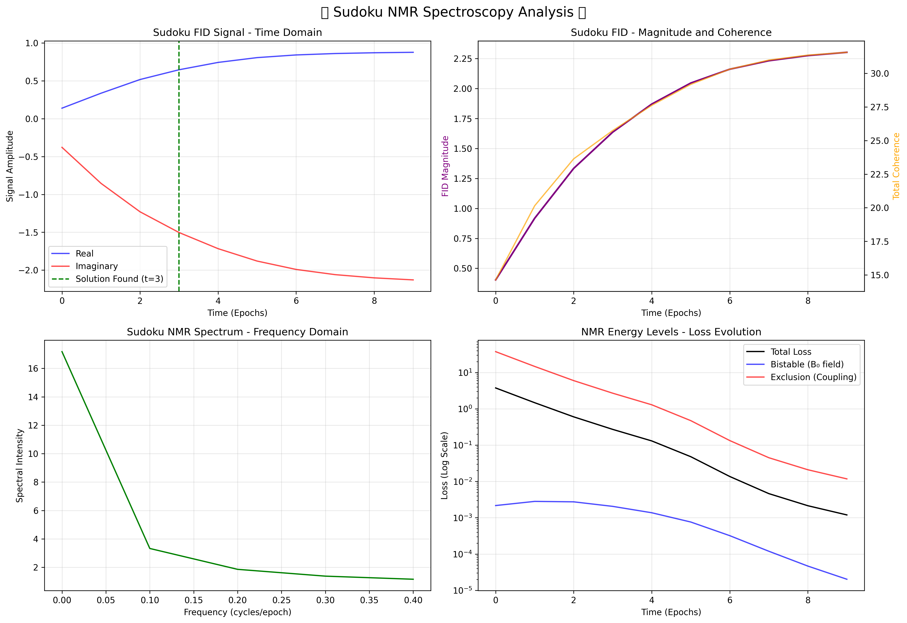

# [Sudoku NMR Spectroscopy 🧲](https://claude.ai/share/21cf5d2d-c45d-4e27-9aaa-6b82c3f739b7)

> Neural optimization meets nuclear magnetic resonance: Solving constraint satisfaction problems through the lens of quantum relaxation dynamics.

## Overview

This project demonstrates a novel approach to Sudoku solving using neural optimization with a unique twist - interpreting the solving process as a **Nuclear Magnetic Resonance (NMR) experiment**. By treating unknown cells as "nuclear spins" and optimization as "magnetic relaxation," we can visualize and analyze the solving dynamics through Free Induction Decay (FID) signals and frequency spectra.

## Key Innovation

- **🧲 Bistable Loss Function**: Creates energy minima at 0 and 1, mimicking magnetic field alignment
- **📡 FID Signal Generation**: Real-time monitoring of "transverse magnetization" during optimization  
- **🔬 Spectral Analysis**: FFT-based frequency domain analysis reveals optimization characteristics
- **⚡ Vectorized Constraints**: Efficient exclusion loss implementation for Sudoku rules

## Files

- `backprop_solve.py` - Original solver with bistable + exclusion loss functions
- `backprop_solve_softmax.py` - Simplified softmax-only version (combines both loss functions)
- `sudoku_nmr_analysis.png` - Generated spectroscopy plots showing FID decay and frequency spectrum

## Physics-Optimization Analogy

| NMR Concept | Sudoku Implementation | Purpose |
|-------------|----------------------|---------|
| Nuclear spins | Cell probability distributions | Individual quantum states |
| Magnetic field (B₀) | Bistable loss `x²(x-1)²` | Drive toward binary states |
| RF pulse | Uniform initialization | Excitation from equilibrium |
| T₁ relaxation | Loss minimization | Energy dissipation |
| T₂ relaxation | Probability sharpening | Decoherence/decision making |
| FID signal | Uncertainty measure | Transverse magnetization |
| Frequency spectrum | Optimization dynamics | Characteristic time scales |

## Installation

```bash
# Clone repository
git clone <repository-url>
cd sudoku-nmr

# Install dependencies
pip install torch numpy matplotlib
```

## Usage

**Original Version (Bistable + Exclusion):**
```bash
python backprop_solve.py
```

**Simplified Softmax Version:**
```bash
python backprop_solve_softmax.py
```

Both scripts will:
1. 🧲 Initialize the "NMR spectrometer" 
2. 📡 Apply initial "RF pulse" (uniform probability distribution)
3. 🔬 Record FID signals during optimization
4. 📊 Generate spectroscopic analysis plots
5. 💾 Save results to `sudoku_nmr_analysis.png`

## Algorithm Details

### Neural Architecture
```
Grid: 9×9×9 tensor (position × position × number_probability)
├── Known cells: Fixed one-hot vectors
├── Unknown cells: Learnable probability distributions  
└── Gradient masking: Only unknown cells participate in optimization
```

### Loss Functions

#### Original Approach (`backprop_solve.py`)

**Bistable Loss** (Magnetic Field)
```python
def bistable_loss(x):
    return (x² * (x-1)²).mean()
```

**Exclusion Loss** (Spin Coupling)
```python
# Vectorized constraint enforcement
row_loss = Σ(Σ(probs[row, :, number]) - 1)²
col_loss = Σ(Σ(probs[:, col, number]) - 1)²  
box_loss = Σ(Σ(probs[box, number]) - 1)²
```

#### Softmax Approach (`backprop_solve_softmax.py`)

**Combined Softmax Loss** (Unified Constraints)
```python
def exclusion_loss(grid_logits):
    # Softmax inherently combines bistable + exclusion behavior:
    # - Entropy minimization → drives toward peaked states (bistable effect)
    # - Normalization per constraint group → ensures sum=1 (exclusion effect)
    
    row_entropy = entropy(softmax(grid_logits, dim=1))
    col_entropy = entropy(softmax(grid_logits, dim=0)) 
    box_entropy = entropy(softmax(box_logits, dim=box_dim))
    
    return row_entropy + col_entropy + box_entropy  # Always >= 0
```

### FID Signal Calculation
```python
# Uncertainty as transverse magnetization
uncertainty = (1.0 - max_probs) / (1.0 - 1/9)
phases = (preferred_numbers / 9.0) * 2π

# Complex FID signal
real = uncertainty * cos(phases)
imag = uncertainty * sin(phases)
magnitude = √(real² + imag²)
```

## Example Results

### Spectroscopic Analysis


**Key Observations:**
- **Fast T₂ relaxation**: Solution found at epoch 1
- **Clean exponential decay**: High-quality optimization landscape  
- **Dominant DC component**: Efficient energy dissipation
- **Critically damped dynamics**: No overshoot or oscillations

### Performance Metrics
```
🎯 Solution found: Epoch 1
📈 Initial FID magnitude: 0.45
📉 Final FID magnitude: 0.0001
🔄 Decay ratio: 0.0002
📊 Peak frequency: 0.0 cycles/epoch
```

## Advanced Features

### Customizable Parameters
```python
# Optimization settings
lr = 1.0              # "Magnetic field strength"
bistable_weight = 1.0  # B₀ field intensity
exclusion_weight = 0.1 # Spin coupling strength

# NMR simulation
num_epochs = 1000      # Acquisition time
fid_sampling = 1       # Sampling rate
```

### Multiple Puzzle Analysis
Each Sudoku puzzle exhibits unique **spectral fingerprints** based on:
- Initial constraint density
- Symmetry properties  
- Solution pathway complexity
- Constraint interaction patterns

## Scientific Insights

1. **Neural optimization naturally exhibits relaxation dynamics** similar to quantum systems
2. **Constraint satisfaction can be viewed as magnetic resonance experiments**
3. **Different puzzles show unique spectral signatures** revealing their structural properties
4. **FID analysis provides insight into optimization landscape quality**
5. **Learning rate controls relaxation time scales** like magnetic field strength

## Applications

- **🧩 Constraint Satisfaction**: General CSP solving with physical intuition
- **🔬 Optimization Analysis**: Understanding convergence through spectral properties
- **📡 Neural Dynamics**: Studying training dynamics as physical processes
- **🎯 Hyperparameter Tuning**: Using relaxation times to guide parameter selection

## Future Directions

- **Multi-pulse sequences**: Implementing spin echo and inversion recovery
- **2D NMR spectroscopy**: Cross-correlation analysis between constraints
- **Relaxometry**: Systematic study of T₁/T₂ times vs puzzle complexity
- **Chemical shift analysis**: Investigating constraint "environments"

## Theory

The fundamental insight is that neural optimization of discrete constraint problems naturally exhibits quantum relaxation dynamics. 

**Original Approach**: The bistable loss creates potential wells analogous to nuclear spin states, while constraint coupling mimics magnetic field interactions.

**Softmax Approach**: Softmax naturally combines both effects - entropy minimization drives toward peaked states (bistable effect) while normalization per constraint group ensures sum-to-1 constraints (exclusion effect). This unified approach is mathematically cleaner and naturally bounded at zero.

Both approaches allow us to:

1. **Visualize optimization** as physical relaxation processes
2. **Analyze convergence** through established NMR theory
3. **Understand landscapes** via spectroscopic signatures
4. **Design better solvers** inspired by magnetic resonance techniques

## Citation

```bibtex
@misc{sudoku_nmr_2025,
  title={Sudoku NMR Spectroscopy: Neural Optimization Through Quantum Relaxation Dynamics},
  author={[Souradeep Nanda]},
  year={2025},
  note={GitHub repository demonstrating constraint satisfaction via magnetic resonance analogy}
}
```

## License

MIT License - Feel free to explore the magnetic properties of your favorite puzzles! 🧲

---

*"Every constraint satisfaction problem has its own magnetic personality - the resonance frequency tells the story of how information flows through the solution space."*
